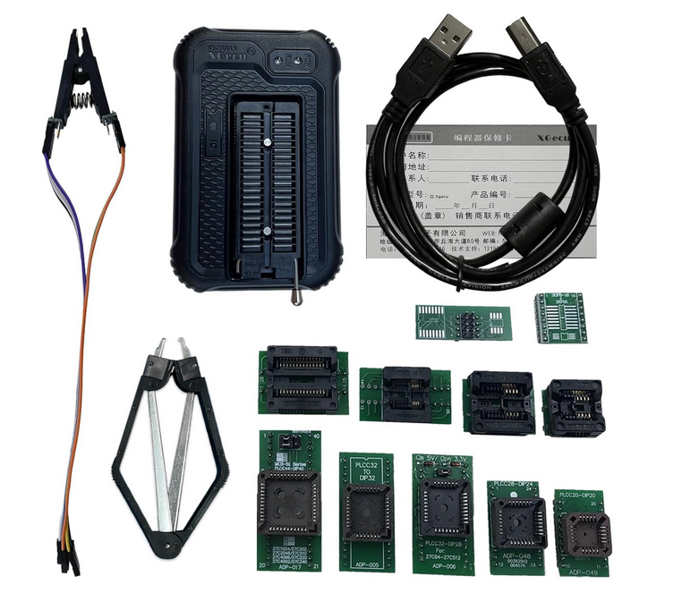
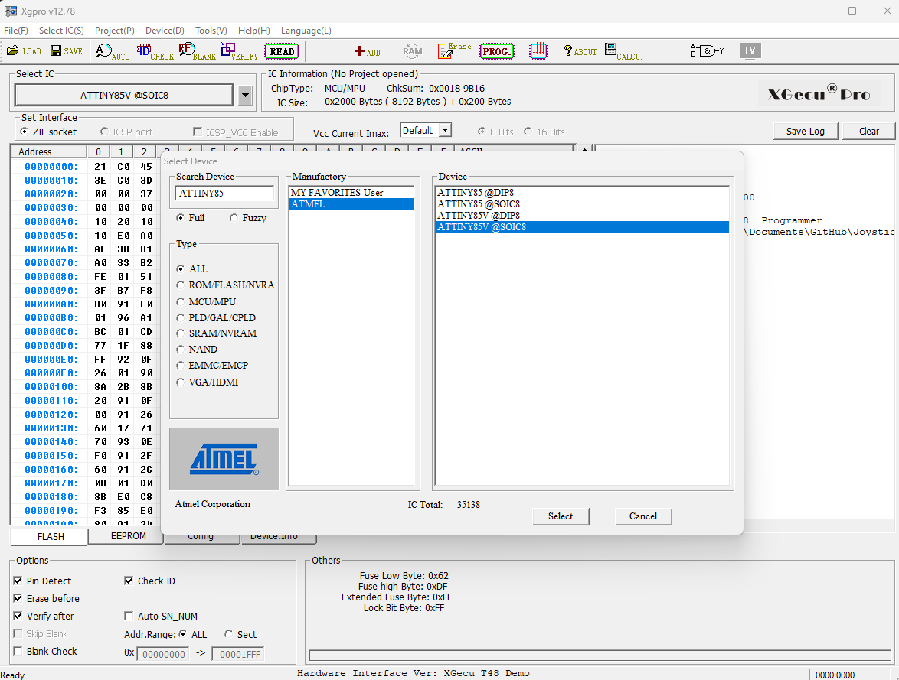
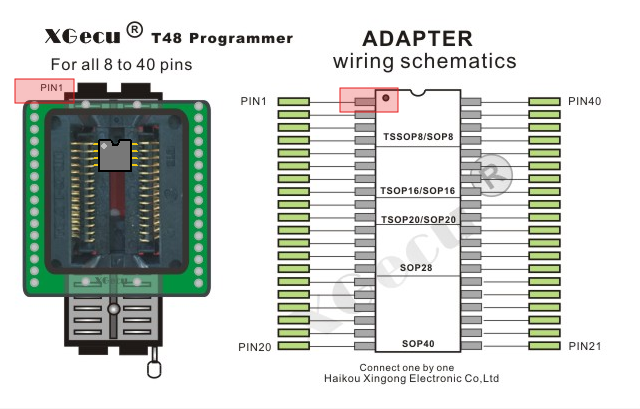
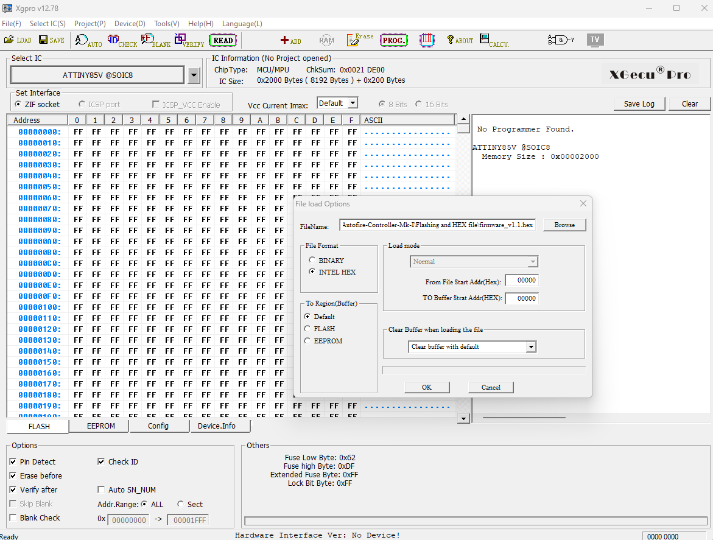
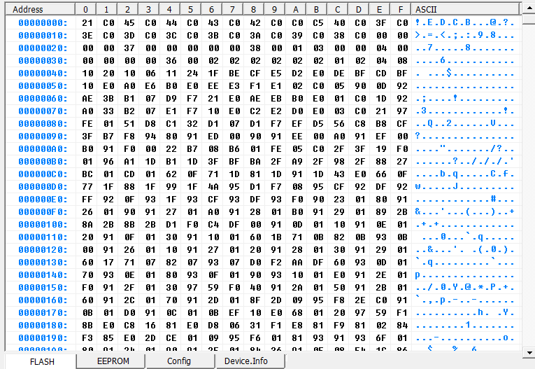
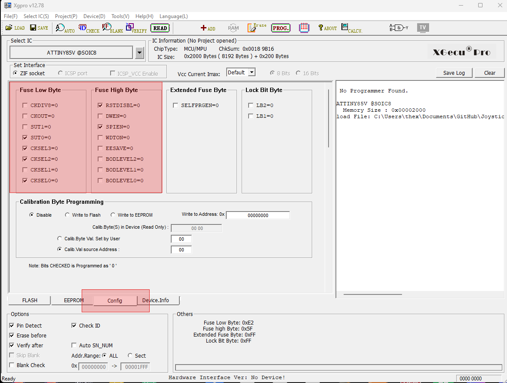
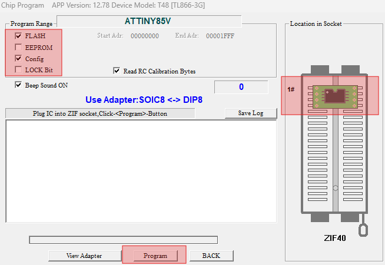

# Flashing code into your ATtiny85

### If you are building a PC board from scratch, the following procedure outlines instructions on how to flash a new, blank, ATtiny85 device using the Xgegcu T48 Programmer. These programmers are widely available on Amazon for very reasonable prices. Below are links to the T48 programmer description and to download the Xgpro application software that will run on your PC. You will also need to download the "firmware_v1.x.hex" file from the "Flashing and HEX file" folder on this git repository and store it in a known location on your PC. This is the file you will LOAD later on in this procedure.  

### Here is a link to a YouTube video that shows the process on how to use the Xgegcu software 

## [Beginners Guide to the Xgecu T48 Programmer](https://youtu.be/36xP4uufo84?si=Jp_okfQR0br4AvkE)

## [Xgegcu T48 Description](http://forums.xgecu.com/viewthread.php?tid=694&extra=page%3D1)

## T48 and typical accessories that come with the bundle on Amazon that cost $79.00 USD as of this writing on 01/27/2025

## 

## [Xgegcu Xgpro Application](http://www.xgecu.com/en/download.html?refreshed=1737924728727)

### Install the software per the instructions and run the application once completed. Attach the USB cable to the programmer and connect the other end to your PC's USB port. The PC should recognize the device. 

### After the application opens, the first step is to select your device as shown. Be sure to select the SOIC version. Either selection will work. The "V" only indicates a wider voltage range device. 
 

### Locate the adapter (Yours may look different) and place it into the ZIF socket of the programmer. Be sure to orient pin 1 correctly as shown below. Now insert the MCU chip into the adapter as shown being sure that pin 1 is in the correct orientation.   

### LOAD the HEX file into memory as shown below. Select OK. The memory view should like shown below. 

### View of memory after LOAD

### Select the fuse options as shown below. This will disable the RESET pin and turn the clock divider OFF thus the MCU will be running the internal oscillator at approximately 4 MHz without the need for an external crystal.    

### Select PROGRAM and the windows will appear below. Make the selections in the program range. It is only important to select the FLASH and CONFIG memories. The flash memory and fuse bits will only be programmed. 

Now select PROGRAM and the progress will be shown in the window. When completed, SUCCESS should be visible. You can now remove the chip and solder to you PCB.  

